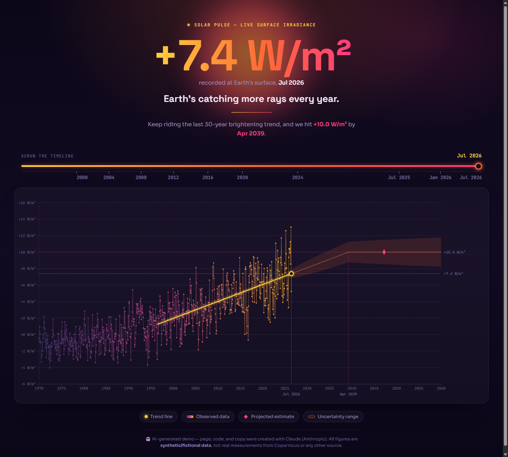

# Solar Pulse — Global Solar Irradiation Trend Monitor

An animated, Copernicus-style dashboard visualizing a rising trend in solar irradiation recorded
at Earth's surface. Drag the "Extrapolate from" slider to re-fit a 30-year trend line from any
point in the timeline and see the projected date it crosses a milestone value.

Static site — just open `index.html` in a browser, no build step or server required.

## Files

- `index.html` — page structure and copy
- `style.css` — dark, sunset-gradient visual theme
- `data.js` — synthetic monthly solar irradiance anomaly data generator (seeded, reproducible)
- `chart.js` — D3.js rendering, regression/extrapolation logic, and the draggable slider

## ⚠️ AI-generated content disclosure

This entire project — code, copy, and visual design — was generated by [Claude](https://claude.com)
(Anthropic), an AI assistant, based on prompts from the repository owner. No human wrote the code
or text by hand.

**The data shown is synthetic and fictional.** It was generated to produce a plausible-looking
rising trend for demonstration purposes, modeled loosely on the visual style of the
[Copernicus Global Temperature Trend Monitor](https://apps.climate.copernicus.eu/global-temperature-trend-monitor/).
It is **not** real solar irradiance data from Copernicus, NASA, NOAA, or any other observational
source, and should not be used, cited, or relied upon as such.

This notice is provided in the spirit of the transparency obligations in Article 50 of the
EU AI Act (Regulation (EU) 2024/1689), most of which apply from 2 August 2026. Article 50 is
squarely aimed at deepfakes (synthetic image/audio/video) and AI-generated text on matters of
public interest — a small data-viz demo like this one doesn't clearly fall under either category
— but disclosing AI authorship and the synthetic nature of the data is good practice regardless,
especially since the page's visual style deliberately echoes a real scientific monitoring tool.
